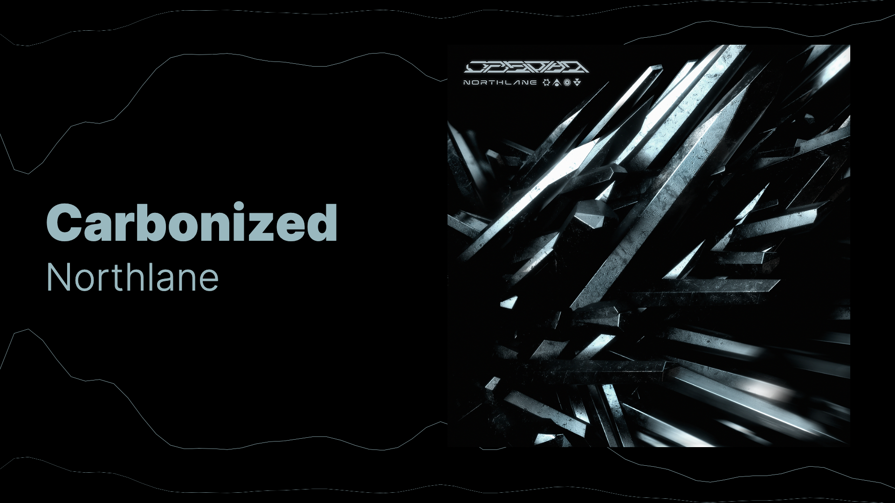
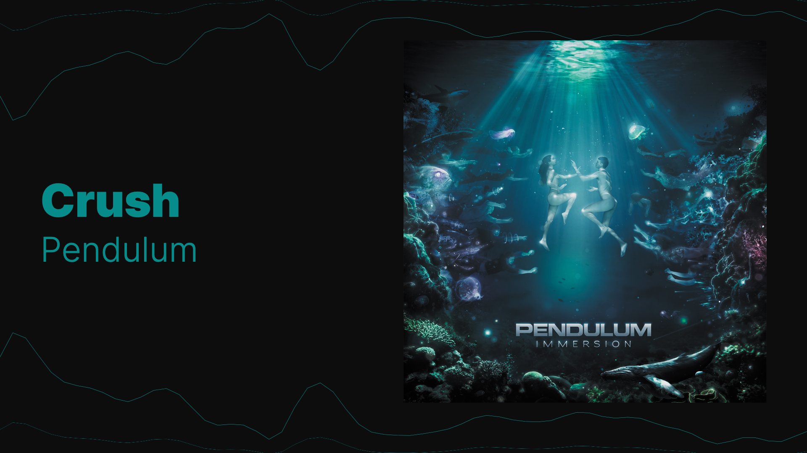

# Remotion Audio Visualizer

Programmatic minimalistic audio visualizations.






<video src="./docs/dna-horizontal-60fps-1920x1080.mp4">

## Development

**Install dependencies**

```sh
nvm use
npm ci
```

**Start video preview in development**

```sh
npm run dev
```

**Render video**

```sh
npm run render --video=ID # Available video ID's can be found in src/Root.tsx file
```

**Test**

```sh
npm run test:lint
npm run test:types
```

**Upgrade dependencies**

```sh
npm run upgrade
```
